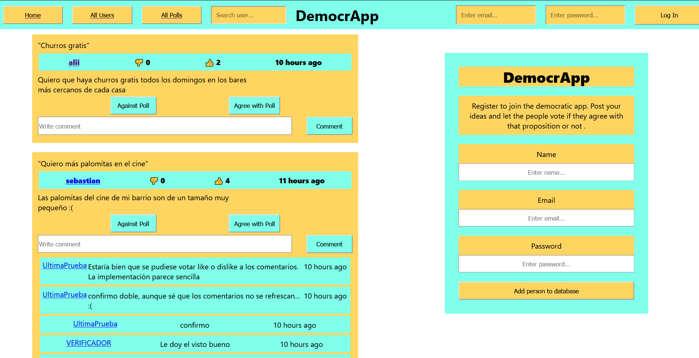

### <h1>Democrapp</h1>

Register to join the democratic app. Post your ideas and let the people vote if they agree with that proposition or not.

In case the idea would be very popular, there could be intentions to try to make agreements with the respective authorities in charge of those propositions.

### <h2>Technologies</h2>

This repository contains a fron-end(client) and a back-end (server). The first is developed with React and deployed with Netlify and the second is stored in a Heruko server connected to a mongoDB database.

### <h2>How to run it on local? </h2>

\*\*The libraries cited at the end of this document are needed for the app to work. Install them beforehand.\*\*

- Clone repository.
- In your root directory start a local database with MongoDb.
- Go to your_cloned_repository
- Start server with "yarn start"
- Start client with "yarn workspace client start"

### <h3>Server inner workings</h3>

Starts a server with express. Some routes are given to it the go through different JS scripts:

- middleware: authorizes or parse request
- controllers: manage petitions
- models: filters and get the data (mongoose)

### <h3>Things to improve</h3>

[] Search bar remove when clicking away or when the input is ''
[] CSS: header
[] CSS: Home page: center polls (when logged and when not)
[] Clicking on a profile should show the profile details
[] Refresh elements on page after clicking Against or Agree buttons
[] Refresh comments when writting a new one
[] Refresh polls when writting a new one
[] 'Problem editting your profile': Profile edit is not available, don´t know why
[] React to comment button when not logged in
[] Creates new user even if there is another one with the same name or email
[] Register new user shouldn´t appear if you are logged in
[] Comment-edit-button should be blue and inside a form with submit
[] Comment-boxes should increase in height and cut the text if this is too long
[] Maked edit-boxes for polls rather than going to other link
[] Responsive for phones
[] More content here about the processes involved

### <h3>Libraries used</h3>

- NodeJS
- React
- Yarn
- MongoDB
- Heroku
- Netlify
- jsonwebtoken (jwt)
- mongoose
- dotenv
- cors
- express
- body-parser
